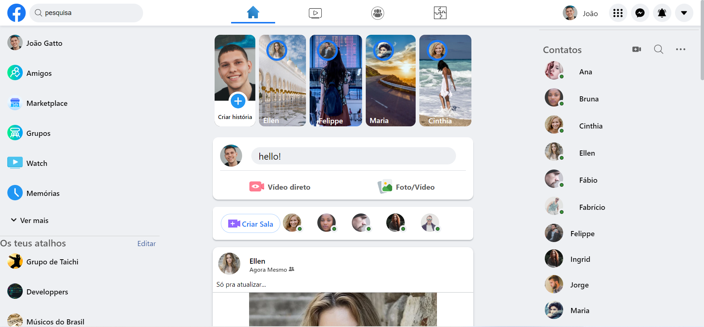

# Sobre

Venho com muita felicidade (e dor nas costas) pra apresentar pra vocês o projeto Facebook Clone finalizado! Estou muuito orgulhoso de resultado. Embora eu pense que o código em si, pode sim melhorar, mas vamos ganhando experiencia aos poucos, certo?
Foi um desafio e tanto, principalmente quando o código foi la pelas suas 300 linhas... mas enfim acabei.
Eu encarei esse projeto como um nemesis pro meu aprendizado em CSS e HTML.

## Tecnologias
    - HTML
    - CSS
 
# LAYOUT

### HOME PAGE 1

### VEJA O VIDEO

