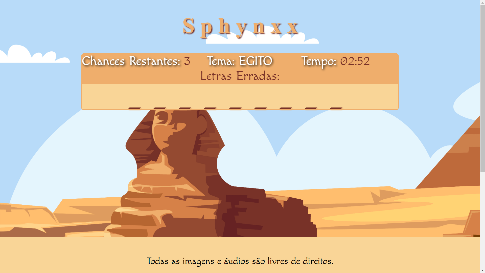

# Sobre

Estou muito orgulhoso em compartilhar com você um mini-game que eu construi com HTML + JS + CSS. Foi bem desafiador o processo de 
  lógica, mas assistindo video aulas, pesquisando e errando bastante, eu consegui chegar em um resultado satisfatório.

# Tecnologias
    - HTML
    - CSS
    - JAVASCRIPT
 
# LAYOUT

# VIDEO
## Veja o video: 

# Autor: João Gatto
# Licença: Free. No copy.
