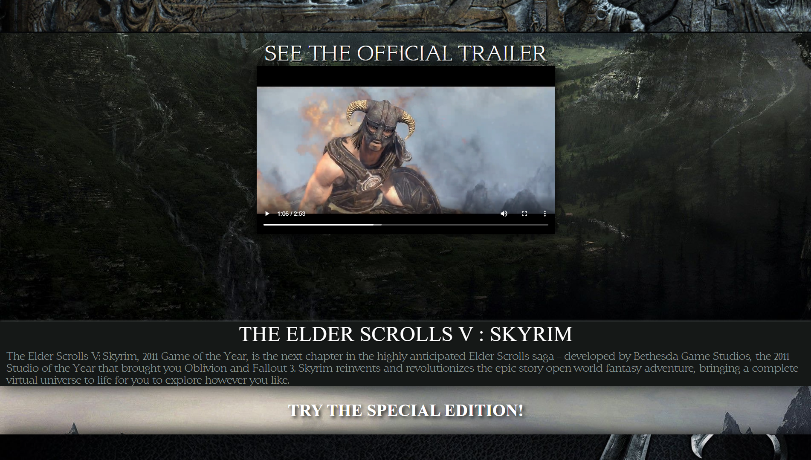
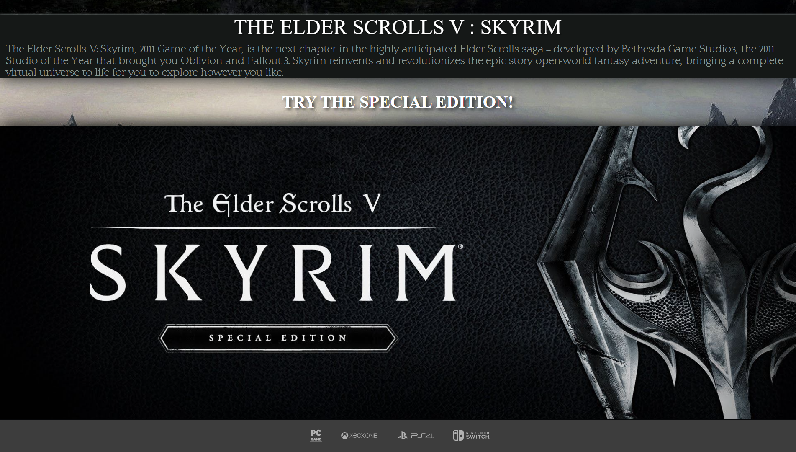
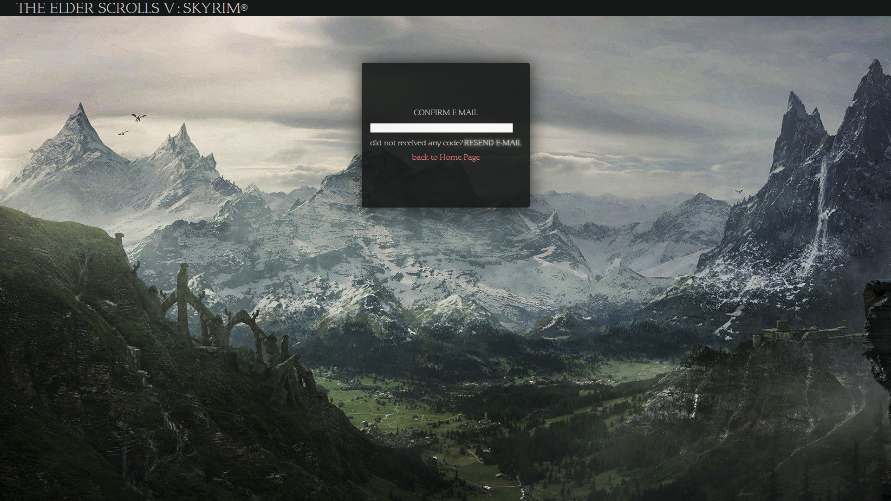
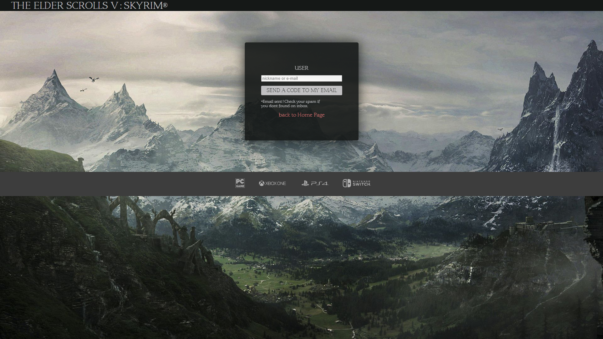
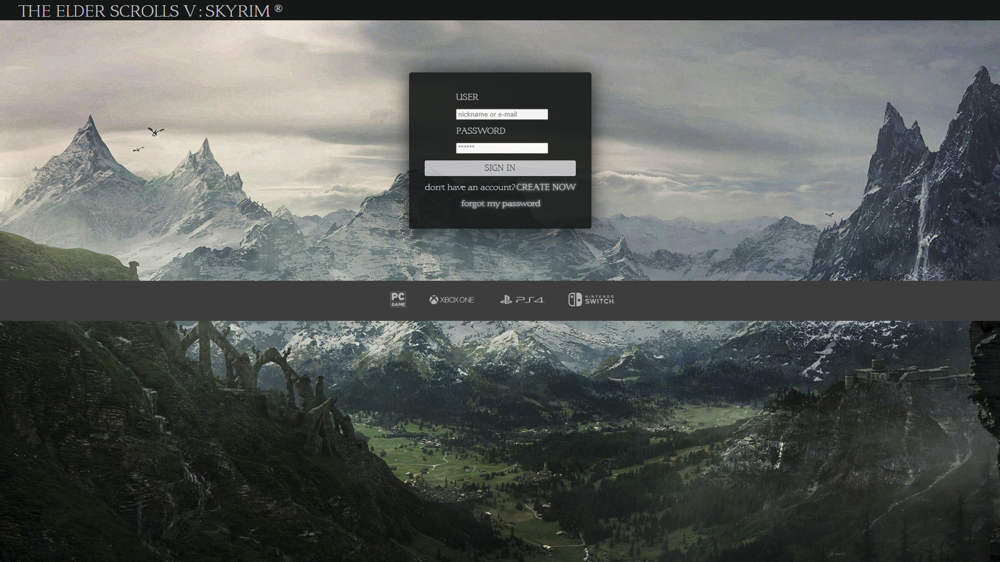

# Sobre

 Olá, este é um projeto iniciante de um site. 
The Elder Scrolls V: Skyrim é um jogo eletrônico que acompanho há muito tempo e tenho muito apreço por ele, por isso, decidi treinar meus conhecimentos em HTML, CSS e 
um pouco de Java Script. 

O site contém uma árvore de paginas, tais ocmo Home Page, Cadastro, Recuperação de senhas e confirmação de emails. 
Foi um desafio produzir este projeto. Fiquei engajado na tarefa por 8horas até finalmente completa-la. Espero que goste :p 

## Tecnologias
    - HTML
    - CSS
    - JAVASCRIPT
 
# LAYOUT

### HOME PAGE 1

### HOME PAGE 2

### HOME PAGE 3

### PÁGINA DE CADASTRO

### CONFIRMAÇÃO DE E-MAIL

### RECUPERAÇÃO DE SENHA

### PÁGINA DE LOGIN

